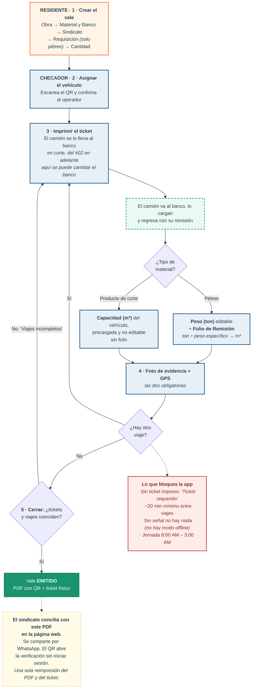
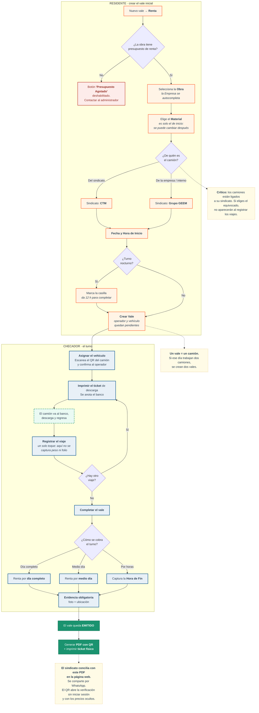
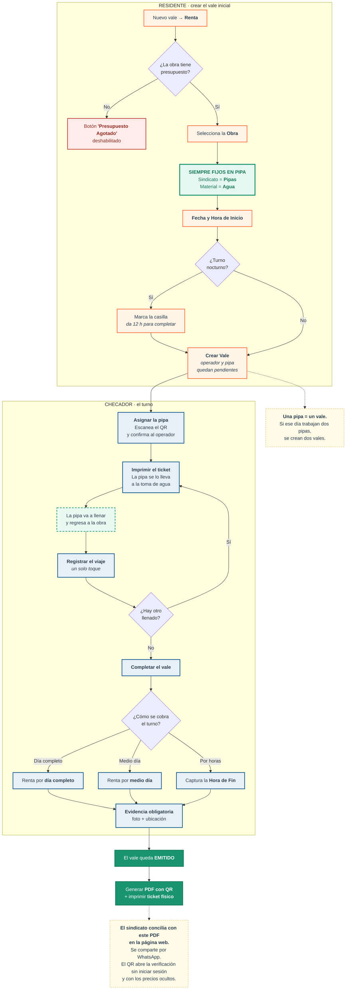
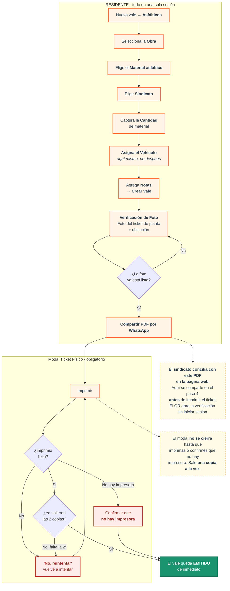
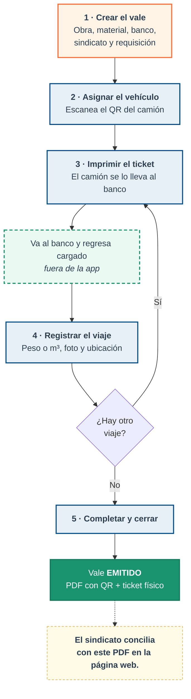
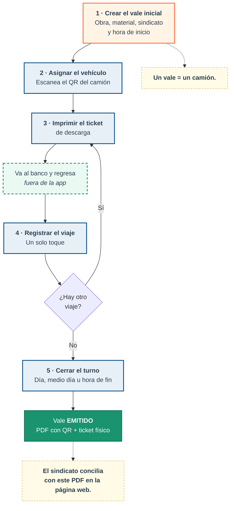
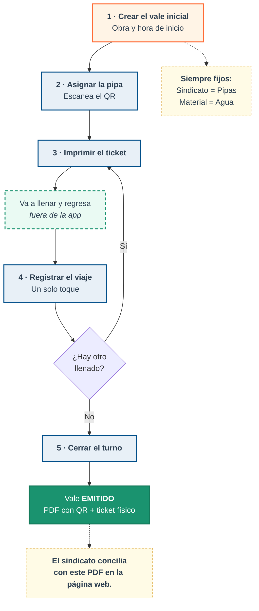
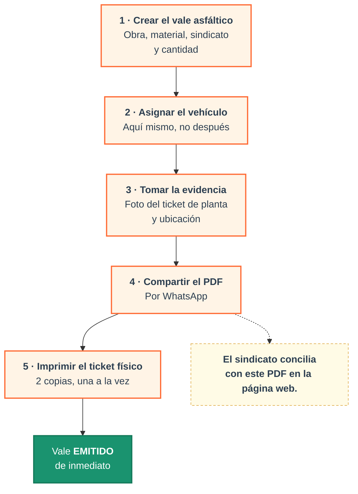

# Diagramas de funcionamiento — código Mermaid

Los 4 procesos en Mermaid, **versión detallada**: con las decisiones y
bifurcaciones reales del sistema (tipo de material, presupuesto, validaciones
que bloquean, cierre del vale).

Al final hay una **versión resumida** de cada uno, por si para exponer prefieres
algo más limpio.

**Cómo convertirlos a imagen:**
1. Abre https://mermaid.live
2. Pega el bloque de código (sin las líneas de ` ``` `)
3. Menú **Actions → PNG** (o **SVG**, si lo quieres nítido a cualquier tamaño)

> Este archivo vive en `herramientas/` porque **no se despliega**: el
> `.vercelignore` excluye esta carpeta. Es material de trabajo, no del sitio.

**Código de colores** (los oficiales del proyecto):

| | Significado |
|---|---|
| Naranja `#ff6b35` | Pasos del **residente** |
| Azul `#004e89` | Pasos del **checador** |
| Verde punteado `#1a936f` | Lo que pasa **fuera de la app** (el camión en la calle) |
| Rojo | **Bloqueos**: la app no deja avanzar |
| Verde sólido | El vale **emitido** / el PDF |
| Amarillo punteado | Notas y reglas |

---

# VERSIÓN DETALLADA

## 1) Material (Flete)

Conserva la bifurcación que de verdad importa — **pétreo vs. producto de corte**
al registrar el viaje — y el cierre que puede rebotar. Las validaciones que
bloquean van juntas en **una sola caja roja**, en vez de una por una: dicen lo
mismo y no alargan el diagrama.

> **Por qué este es más corto que el primero que hice.** En Mermaid no se puede
> acomodar el diagrama a mano: el alto lo decide el **número de eslabones de la
> cadena** (cada `A --> B` agrega un nivel). La versión anterior encadenaba los
> 6 campos del residente uno por uno y metía cada validación como rombo aparte:
> ~20 niveles. Aquí el residente es **una sola caja** y las validaciones son una
> nota: **9 niveles**. La regla es: *para acortarlo, quita flechas de la cadena
> principal, no busques una opción de configuración.*



---

## 2) Renta de Camión

Aquí la renta es **por tiempo**, no por viaje. Las bifurcaciones: el
**presupuesto** de la obra (si se agotó, no hay vale), el **sindicato** según de
quién sea el camión, el **turno nocturno**, y cómo se cobra al cerrar.



---

## 3) Renta de Pipa

Mismo flujo que renta de camión, pero **dos campos son fijos**: sindicato
**Pipas** y material **Agua**. Eso elimina la bifurcación del sindicato.



---

## 4) Flete Asfáltico

El único **sin ciclo y sin checador**. Su bifurcación fuerte está al final: el
modal del **ticket físico es obligatorio** y sale una copia a la vez, así que se
pasa dos veces por él.



---

# VERSIÓN RESUMIDA

Solo los hitos y el ciclo, sin decisiones. Útil si el diagrama detallado queda
muy denso para proyectar.

## Material — resumido



## Renta de Camión — resumido



## Renta de Pipa — resumido



## Flete Asfáltico — resumido



---

## Si algo no renderiza

- Los `<b>` y `<br/>` dentro de las cajas necesitan **htmlLabels** activo. En
  mermaid.live viene activo por defecto; si usas otro visor y ves las etiquetas
  literales, quítalos y deja el texto plano.
- Si un diagrama detallado sale muy alto para tu diapositiva, cambia
  `flowchart TD` por `flowchart LR`: lo acuesta de izquierda a derecha.
- Los `subgraph` son las bandas por rol. Si estorban visualmente, bórralos
  (deja las cajas sueltas) — las flechas siguen funcionando igual.
